# Bosta-Assessment

This Repo is for the backend assessment for Bosta backend postion

# How To Run

1. Make sure that docker is installed and that the docker deamon is running
2. Create a new directory called data inisde of the database directory (this is where the datbase files will be strored)
3. Run docker compose up --build

The server should be running by default on port 8000

Note: The backend server tries to connect to the database before its ready to accept connection so it might crash the first couple of times however the container has a resart policy of unless stopped so it will restart itself untill the database container is ready for connections.

# DataBase Schema

# API Endpoints

### Register:

This endpoint is used to create and register an Admin user, the admin user will be able to access the book and  borrower routes, while non-admin users won't

###### Endpoint name: "/register"

###### Endpoint method: POST

###### Endpoint paramters:

* username(required): the username of the admin
* passowrd(required): the password for the admin account

###### EndPoint response:

* status: a string indicating the status of the operation result
* data: a string with a message for more clarification

###### Example for hiting the endpoint:

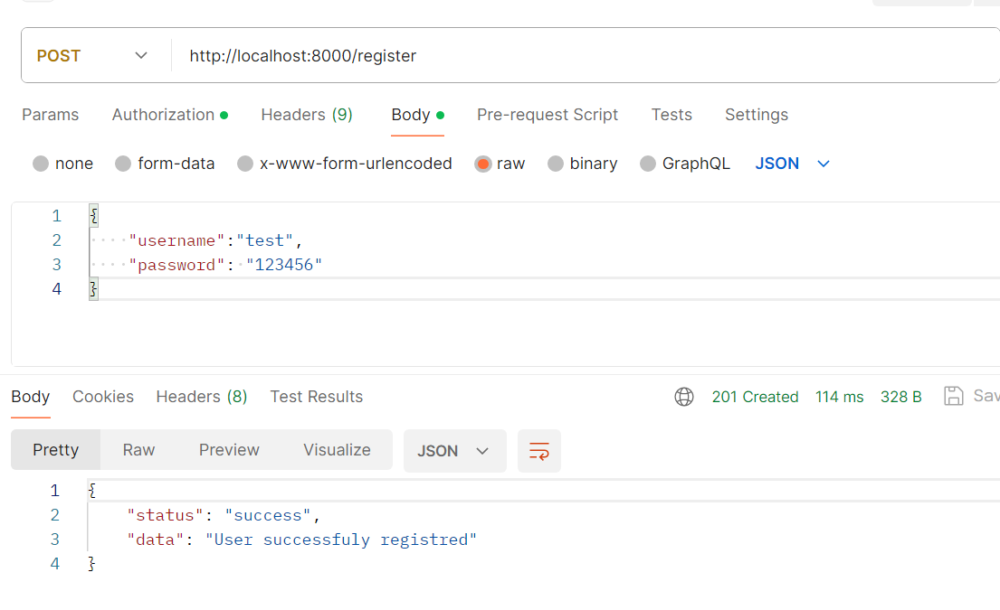

### Login:

This endpoint is used to login as an Admin user, the admin user will be able to access the book and  borrower routes, while non-admin users won't

###### Endpoint name: "/login"

###### Endpoint method: POST

###### Endpoint paramters:

* username(required): the username of the admin
* passowrd(required): the password for the admin account

###### EndPoint response:

* status: a string indicating the status of the operation result
* data: an object containing 2 fields
  1- the acess token (expires after 1h)
  2- the refresh token (expires after 1d)

###### Example for hiting the endpoint:

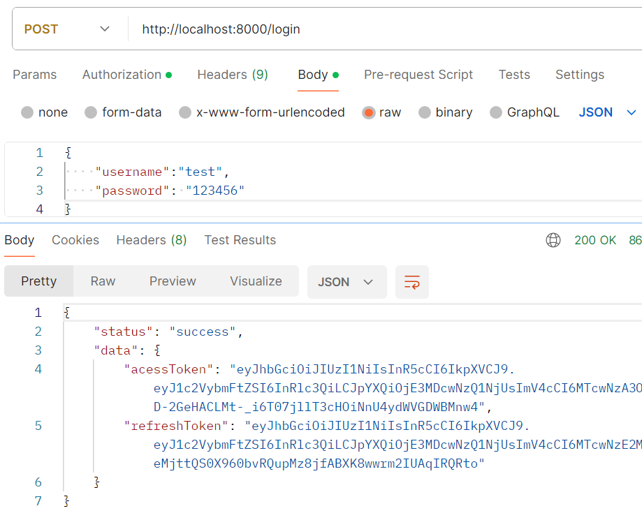

### Book:

This endpoint is used for creating, updating, deleting and fetching book entities stored in the database, this endpoint is protected and can only be accesed as an admin so make sure to send the acess token in the authorization headers as so

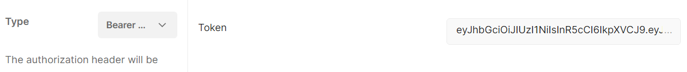

#### Creating:

###### Endpoint name: "/book"

###### Endpoint method: POST

###### Endpoint paramters:

* title(required): the book title
* author(required): the author of the book
* isbn(required): the isbn of the book
* available_quantity(required): an intger representing the available quantitiy for the this book
* shelf_location(required): the location of the book

###### EndPoint response:

* status: a string indicating the status of the operation result
* data: a string with a message for more clarification

###### Example for hiting the endpoint:

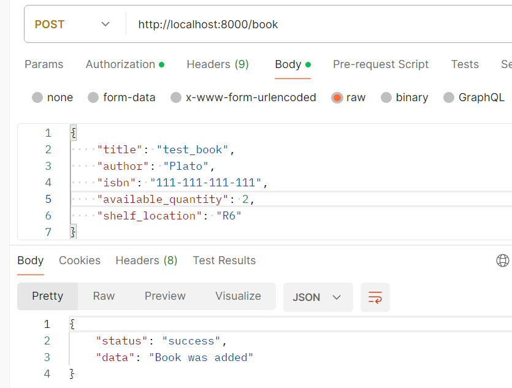

#### Updating:

the updating is a full update not a patch update

###### Endpoint name: "/book/`<book_id>`"

###### Endpoint method: PUT

###### Endpoint paramters:

* title(required): the book title
* author(required): the author of the book
* isbn(required): the isbn of the book
* available_quantity(required): an intger representing the available quantitiy for the this book
* shelf_location(required): the location of the book

###### EndPoint response:

* status: a string indicating the status of the operation result
* data: a string with a message for more clarification

###### Example for hiting the endpoint:

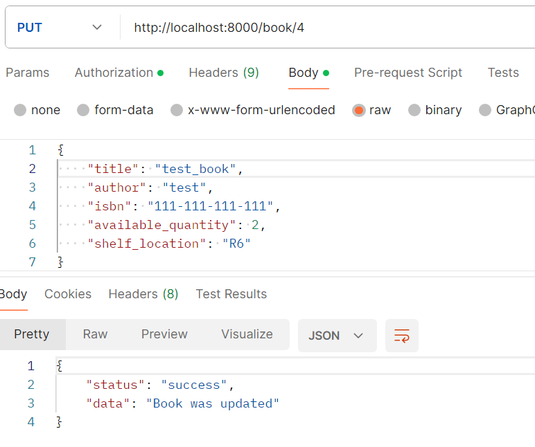

#### Deleting:

###### Endpoint name: "/book/`<book_id>`"

###### Endpoint method: DELETE

###### Endpoint paramters:

No Parameters are needed

###### EndPoint response:

* status: a string indicating the status of the operation result
* data: a string with a message for more clarification

###### Example for hiting the endpoint:

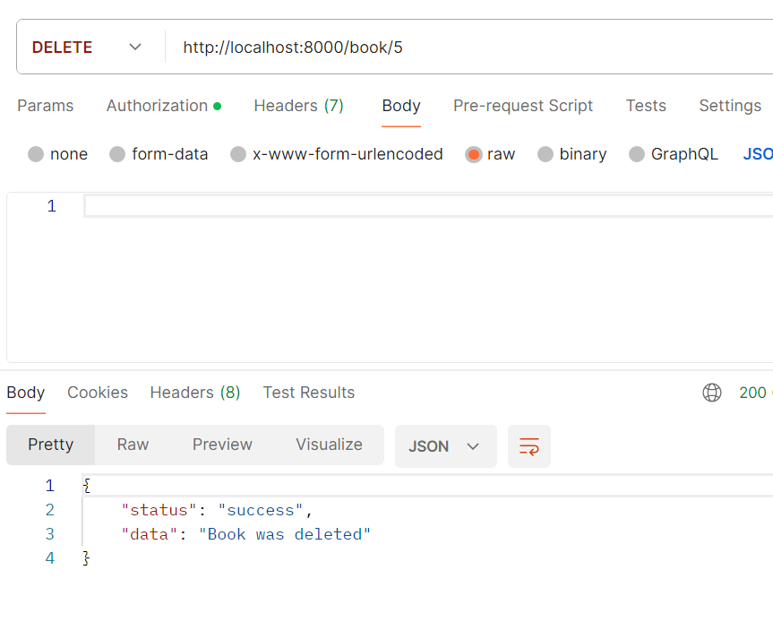

#### Fetching:

###### Endpoint name: "/book"

###### Endpoint method: GET

###### Endpoint paramters:

* title (optional): the title of the book
* author(optional): the author of the book
* isbn(optional): the isbn of the book

Note: not passing any query paramters will result in fetching all the books, and you can use any combination to filter on the books

###### EndPoint response:

* status: a string indicating the status of the operation result
* data: an array of book entities

###### Example for hiting the endpoint:

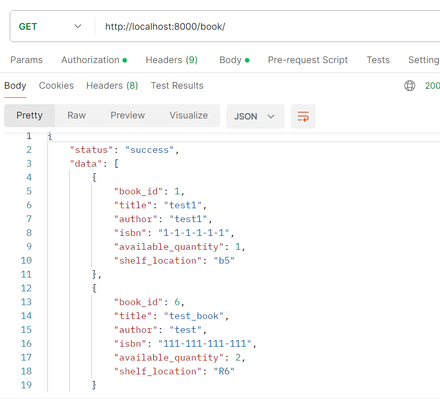

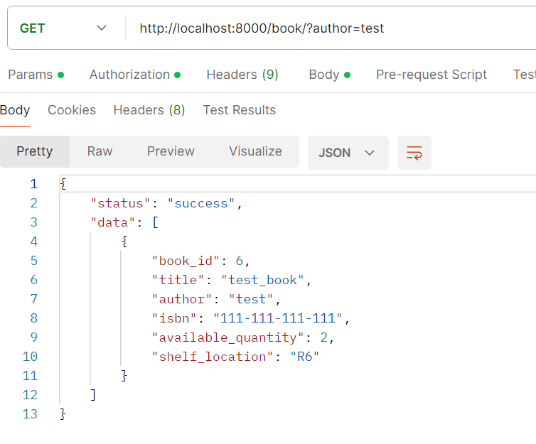

### Borrower:

This endpoint is used for creating, updating, deleting and fetching borrower entities stored in the database, this endpoint is protected and can only be accesed as an admin so make sure to send the acess token in the authorization headers as so

#### Creating:

###### Endpoint name: "/borrower"

###### Endpoint method: POST

###### Endpoint paramters:

* name(required): the name of the borrower
* email(required): the email of the borrower
* register_date(required): the date string in the following format YYYY-MM-DD

###### EndPoint response:

* status: a string indicating the status of the operation result
* data: a string with a message for more clarification

###### Example for hiting the endpoint:

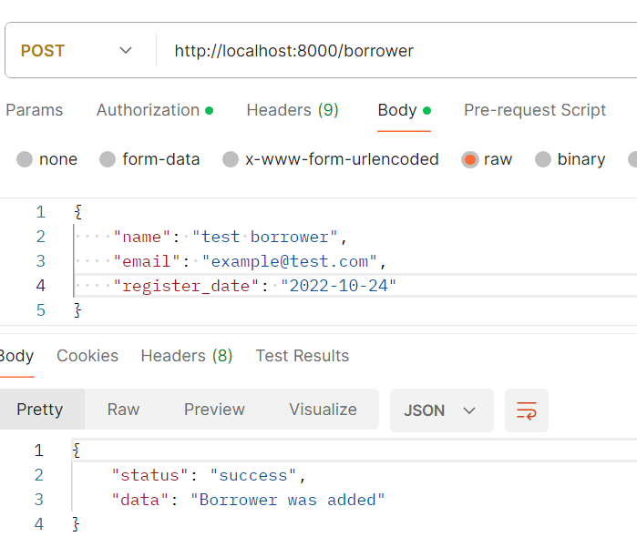

#### Updating:

the updating is a full update not a patch update

###### Endpoint name: "/borrower/`<borrower_id>`"

###### Endpoint method: PUT

###### Endpoint paramters:

* name(required): the name of the borrower
* email(required): the email of the borrower
* register_date(required): the date string in the following format YYYY-MM-DD

###### EndPoint response:

* status: a string indicating the status of the operation result
* data: a string with a message for more clarification

###### Example for hiting the endpoint:

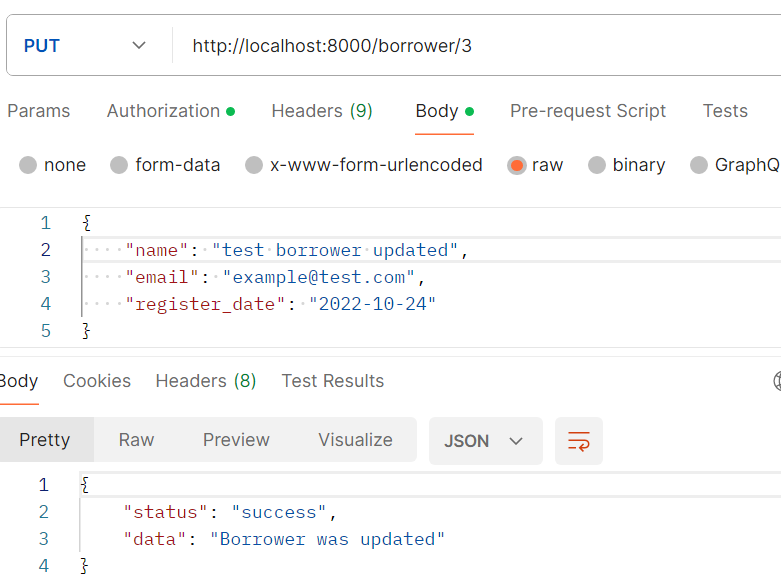

#### Deleting:

###### Endpoint name: "/borrower/`<borrower_id>`"

###### Endpoint method: DELETE

###### Endpoint paramters:

No Parameters are needed

###### EndPoint response:

* status: a string indicating the status of the operation result
* data: a string with a message for more clarification

###### Example for hiting the endpoint:

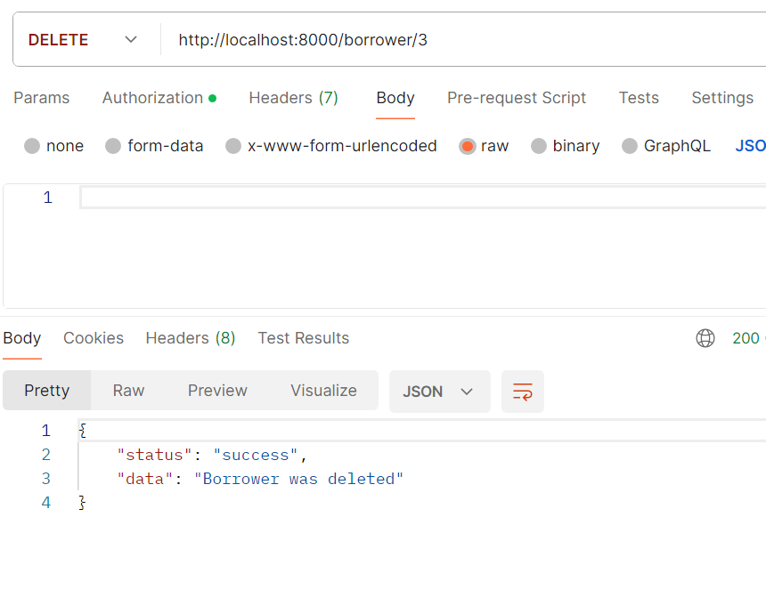

#### Fetching:

###### Endpoint name: "/borrower"

###### Endpoint method: GET

###### Endpoint paramters:

No paramters are needed all the borrowers are fetched with the GET request

###### EndPoint response:

* status: a string indicating the status of the operation result
* data: an array of borrower entities

###### Example for hiting the endpoint:

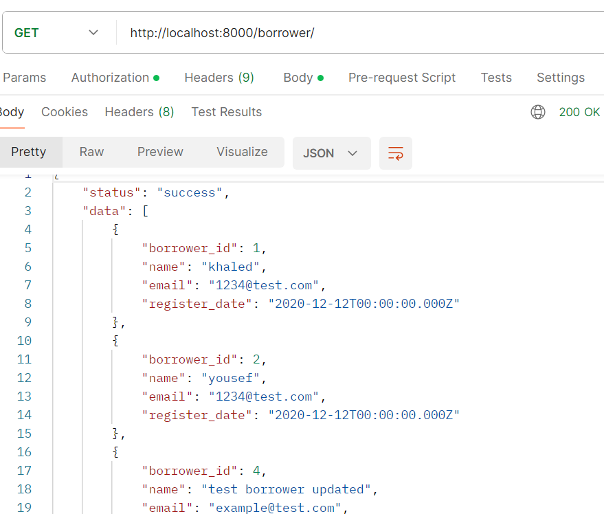

### Borrow

This end point is used to make borrow and return requests, it also is used to view the books that a borrower has borrowed, and view all overdue books in the system

#### Borrowing a book:

###### Endpoint name: "/borrow"

###### Endpoint method: POST

###### Endpoint paramters:

* borrower_id(required): an intger representing id of the borrower
* book_id(required): an intger representing the id of the book to borrow
* due_date(required): the date to return the book at, the date has to be in the following format: YYYY-MM-DD

###### EndPoint response:

* status: a string indicating the status of the operation result
* data: a string with a message for more clarification

###### Example for hiting the endpoint:

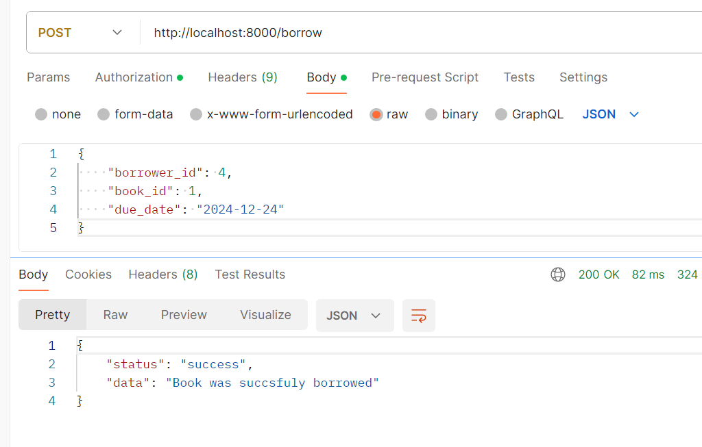

#### Returning a book:

###### Endpoint name: "/borrow/return"

###### Endpoint method: POST

###### Endpoint paramters:

* borrower_id(required): an intger representing id of the borrower
* book_id(required): an intger representing the id of the book to borrow

###### EndPoint response:

* status: a string indicating the status of the operation result
* data: a string with a message for more clarification

###### Example for hiting the endpoint:

#### Viewing borrowed books:

###### Endpoint name: "/borrow/`<borrower_id>`"

###### Endpoint method: GET

###### Endpoint paramters:

No Parameters are needed

###### EndPoint response:

* status: a string indicating the status of the operation result
* data: an array of book entties

###### Example for hiting the endpoint:

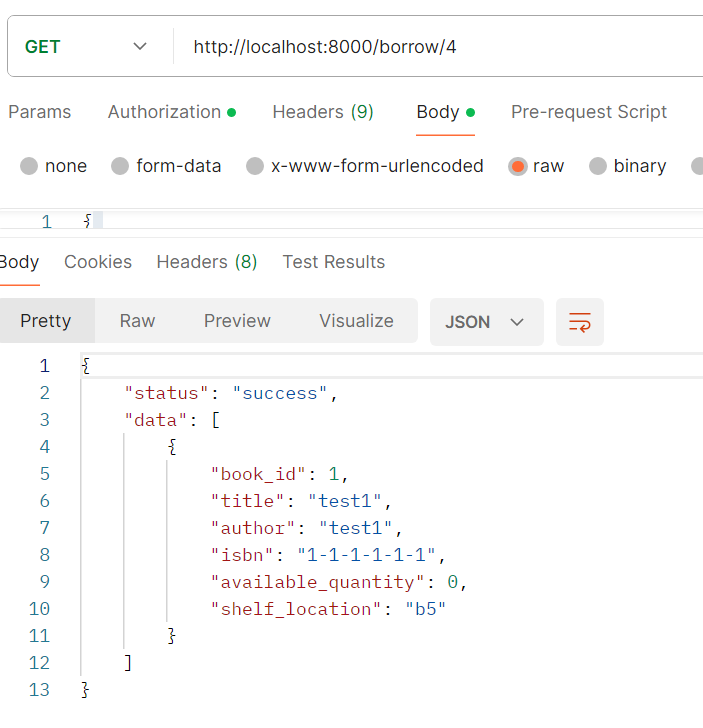

#### Viewing all overdue books:

###### Endpoint name: "/borrow/overdue"

###### Endpoint method: GET

###### Endpoint paramters:

No Parameters are needed

###### EndPoint response:

* status: a string indicating the status of the operation result
* data: an array of borrowed books response

###### Example for hiting the endpoint:

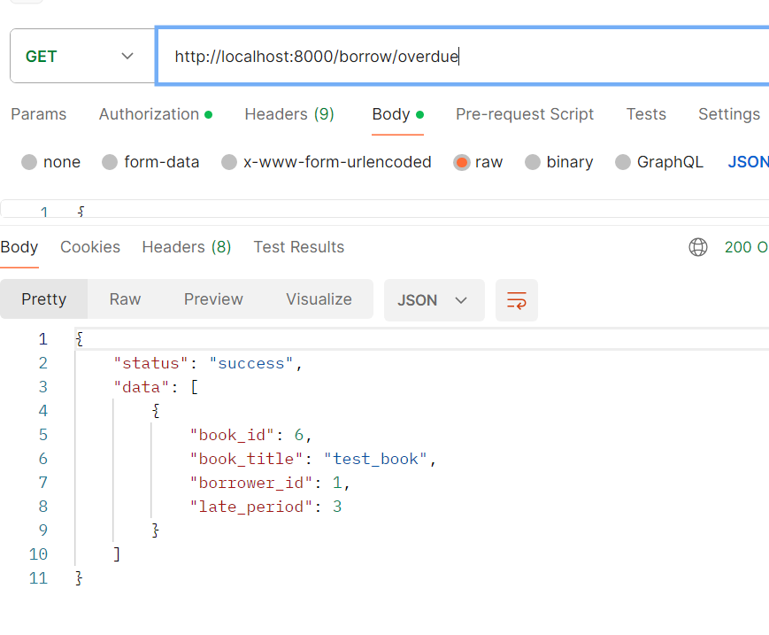

Note the late_period represents the number of days the book was overdue at the time of request
